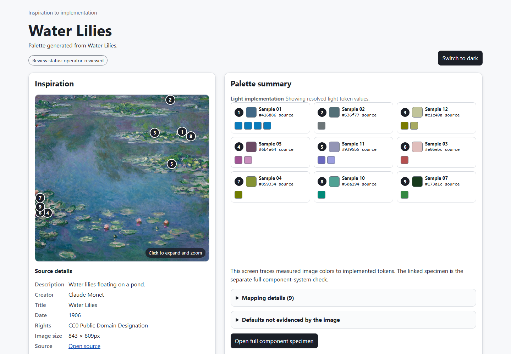
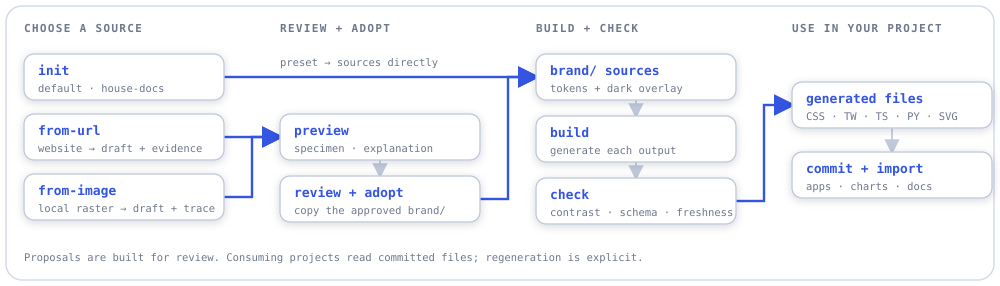
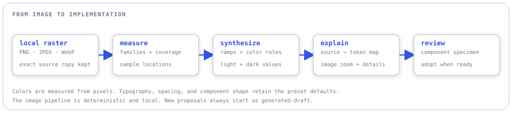
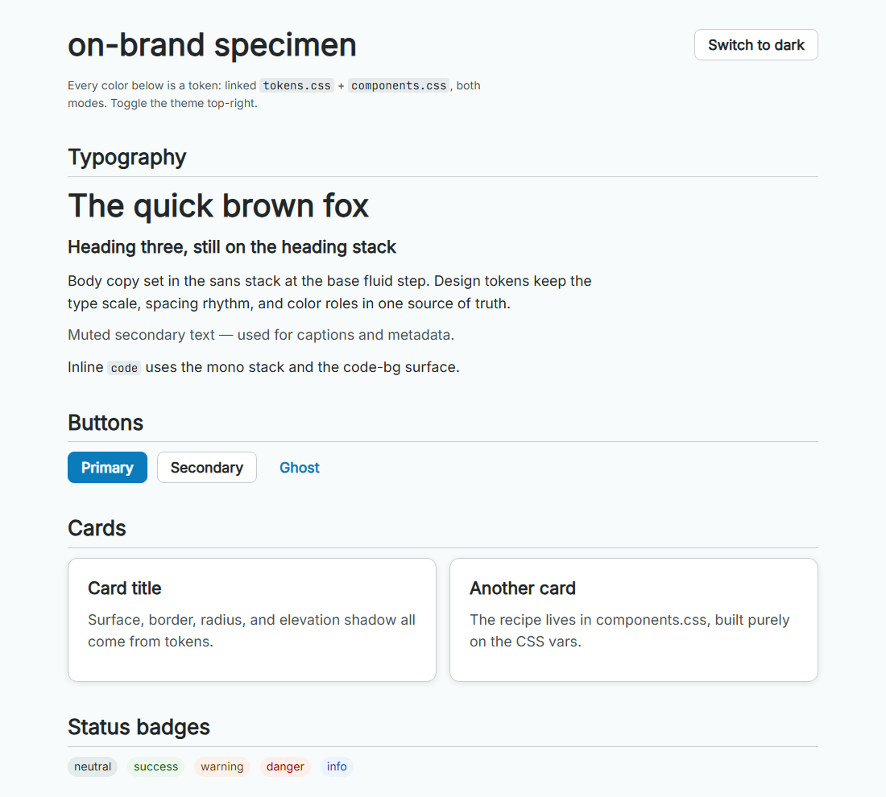
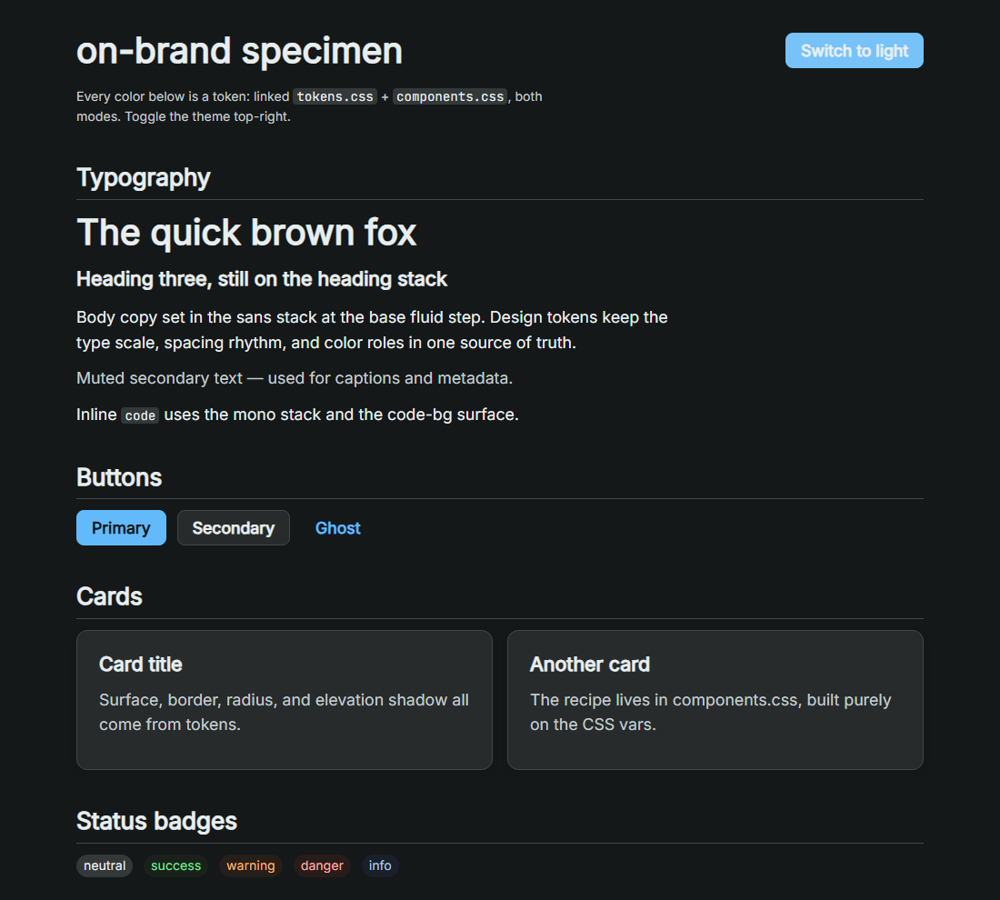
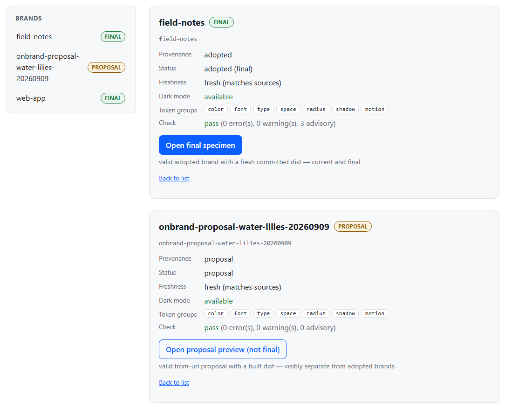

# on-brand

Turn a website, an image, or a preset into a portable brand kit for apps, charts, and documentation.

on-brand is a local CLI that keeps a project's visual identity in a checked-in `brand/` directory. One design-token source produces CSS, Tailwind themes, TypeScript and Python constants, diagram palettes, and a guide for coding agents. Browser previews let you inspect the result before using it.

- **Start from what you have.** Scaffold a preset, extract a website's visual style, or measure a palette from a local image.
- **See where the colors came from.** Image proposals connect numbered samples in the source to the tokens they produce, in light and dark mode.
- **Use the same brand across surfaces.** Generate styles for UI components, charts, diagrams, and docs from the same tokens.
- **Keep the result with your project.** Commit the generated files; consuming projects have no build-time dependency on on-brand.



*The actual generated explanation for Claude Monet's **Water Lilies** (1906), using the Art Institute of Chicago's CC0 image. [Source, attribution, and review record](examples/inspiration/water-lilies/PROVENANCE.md).*

## How it works

<picture>
  <source media="(prefers-color-scheme: dark)" srcset="docs/images/readme/brand-workflow-dark.svg">
  <source media="(prefers-color-scheme: light)" srcset="docs/images/readme/brand-workflow-light.svg">
  
</picture>

Extraction creates a proposal directory. Review its guide and previews, adjust the tokens, then copy the approved `brand/` into your project. Adoption is an explicit file operation; the extractor never changes your app automatically.

## Quick start

Requires Node **20.19+ within v20, or 22.12+** (the exact package range is `^20.19.0 || >=22.12.0`). Run from a source checkout:

```powershell
git clone https://github.com/aberson/on-brand.git
cd on-brand
npm ci
npx playwright install chromium

# Create a brand, build its outputs, check it, and open the component preview.
node bin/onbrand.mjs init ../on-brand-demo --preset default
node bin/onbrand.mjs build ../on-brand-demo
node bin/onbrand.mjs check ../on-brand-demo
node bin/onbrand.mjs preview ../on-brand-demo --open
```

Chromium is used for website extraction and automated screenshots. The previews themselves are local HTML files you can open in a browser. No model credentials are required for this quick start or the image workflow. The optional website assist uses an authenticated `claude` CLI; `--no-llm` skips it.

Commands below run from the on-brand checkout. Project arguments point to the directory **containing** `brand/`.

## Workflows

### Drop an image into the local studio

```powershell
node bin/onbrand.mjs studio --out ../my-private-brands --open
```

In your browser, drop a PNG, JPEG, or WebP (up to 5 MB) onto **Drop your image here**
to generate a theme. The command window keeps the studio running and does not
accept image drops. If the browser does not open, use the address printed after
**Create brand:**. The filename supplies
the initial brand name; you can edit the name and optionally describe the image.
The page shows progress, a component preview, measured color swatches, and the
saved folder path. Click an available swatch to choose the main accent and
generate another version. Every run creates a fresh proposal; earlier versions
are preserved. Both light and dark tokens and all normal exports are included.

The studio runs on `127.0.0.1`, chooses a free port, processes one image at a time,
and uses no model. Images remain on your computer. Use **Quit** in the page or
Ctrl+C to stop the local process. Saved HTML previews also work after it stops.
Without `--out`, new themes are saved under `./brands`. Use `--port` to select a
fixed port when wiring a launcher. A Windows shortcut can target `node.exe`
with the absolute path to `bin/onbrand.mjs`, followed by `studio --out
<directory> --open`; set the shortcut's working directory to this checkout.

Choosing an accent records a human choice, without marking the draft as reviewed.
Explicit choices use version 2 of the inspiration trace; automatic generation
remains version 1. See [format compatibility](docs/inspiration-contract.md#explicit-user-accents-and-format-compatibility)
before exporting these themes to an older inventory reader.

### From an image to an explained palette

`from-image` accepts a local PNG, JPEG, or WebP. It measures color clusters, chooses primary, neutral, and secondary colors, and builds a complete proposal with an exact copy of the input image.

<picture>
  <source media="(prefers-color-scheme: dark)" srcset="docs/images/readme/image-workflow-dark.svg">
  <source media="(prefers-color-scheme: light)" srcset="docs/images/readme/image-workflow-light.svg">
  
</picture>

Try it with the included artwork:

```powershell
node bin/onbrand.mjs from-image examples/inspiration/water-lilies/brand/assets/inspiration.jpg `
  --title "Water Lilies" --alt "Water lilies floating on a pond." --out ../brand-proposals
```

The command prints the new proposal directory. Open its `brand/dist/inspiration-to-implementation.html` to inspect the source samples and their token mappings, switch themes, zoom into the image, or follow the link to the full component specimen.

Each image proposal includes:

| File | What it tells you |
|---|---|
| `raw-image-analysis.json` + `image-report.md` | Measured colors and the palette selection evidence. |
| `brand/assets/inspiration.*` | The exact source image. |
| `brand/inspiration.json` | Source metadata, sample locations, token mappings, and review status. |
| `brand/dist/inspiration-to-implementation.html` | A visual explanation of how the image became a palette. |
| `brand/dist/specimen.html` | How the resulting tokens look on components, charts, and diagram swatches. |

Image extraction is deterministic and runs without a model or network request. Typography, spacing, radius, shadows, motion, and status colors come from the base preset and are identified as defaults. Artwork identity and rights are supplied by the operator through metadata flags such as `--creator`, `--source-url`, and `--rights`; they are never inferred from pixels.

Fresh proposals are marked `generated-draft`. The checked-in [Water Lilies example](examples/inspiration/water-lilies/) records an operator's review of that exact output. To explore the released example, open its existing HTML files directly; generate new proposals elsewhere when experimenting.

### Preview a brand on real components

The specimen renders typography, buttons, cards, badges, tables, form controls, chart colors, and diagram palettes from the generated files. Its light/dark toggle uses the same theme values a consuming project receives.

<table>
  <tr>
    <th>Light</th>
    <th>Dark</th>
  </tr>
  <tr>
    <td></td>
    <td></td>
  </tr>
</table>

*Two captures of the released Water Lilies specimen. Image-derived colors supply the palette; typography and other unobserved design choices retain the preset defaults.*

Edit `brand/tokens.json` and `brand/modes.dark.json`, then rebuild and reopen the preview:

```powershell
node bin/onbrand.mjs build ../on-brand-demo
node bin/onbrand.mjs check ../on-brand-demo
node bin/onbrand.mjs preview ../on-brand-demo --open
```

### From a website to a brand proposal

```powershell
node bin/onbrand.mjs from-url https://csszengarden.com/221/ --out ../brand-proposals --no-llm
```

The website path uses dembrandt and Chromium to extract computed styles, normalize colors into ramps, and map font stacks to free lookalikes. The proposal contains a draft guide, generated outputs, raw extraction data, screenshots, and an `extraction-report.md` with confidence and selection evidence. Generate its component preview with `preview <proposal-directory> --open`.

Use `--pages <n>` to merge multiple pages or `--dark` to capture a dark variant. Omit `--no-llm` to allow optional model assistance with color selection, an aesthetic summary, and a voice draft. Website extraction approximates visual identity; page layout and source font files are not copied. If a stage fails, partial evidence remains alongside an `INCOMPLETE.md` marker.

### Browse brands across a workspace

```powershell
node bin/onbrand.mjs gallery --root ../my-workspace --open
node bin/onbrand.mjs brands list --root ../my-workspace --json
```

The gallery discovers `brand/` directories, separates adopted brands from proposals, reports freshness and check results, and links to their specimens. Stale, incomplete, and invalid sets remain visible with their status.



*A real gallery generated from two preset-based demo projects and one fresh image proposal. The capture frames the list and details below the machine-specific workspace header.*

## What your project keeps

```text
your-project/brand/
  tokens.json        # source of truth: DTCG-format design tokens
  modes.dark.json    # dark-mode color overrides
  guide.md           # human-owned guidance + generated token tables
  assets/            # optional logos, icons, or source inspiration
  inspiration.json   # image-to-token trace, when generated from an image
  dist/              # generated files; commit these with your project
```

The compiler supports a defined subset of the DTCG token format, including preset inheritance and color overlays. Its outputs cover:

| Output in `brand/dist/` | Use it for |
|---|---|
| `tokens.css` | CSS custom properties with light/dark values. |
| `theme.tw.css` | A Tailwind v4 `@theme` block. |
| `theme.ts` | Typed `theme` and `darkTheme` constant trees. |
| `tokens.py` | Python constants and categorical chart palettes. |
| `components.css` | Token-based component recipes. |
| `palette.svg` + `diagram-palette.json` | Palette reference and named colors for diagram tooling. |
| `DESIGN.md` | Generated design context for coding agents. |
| `manifest.json` | Source hashes and generation provenance used to detect stale outputs. |

For example, link the generated CSS in a page at your project root:

```html
<link rel="stylesheet" href="brand/dist/tokens.css">
<link rel="stylesheet" href="brand/dist/components.css">
<button class="btn">Save changes</button>
```

Use `data-theme="dark"` on the root HTML element for the dark theme. React consumers can import `theme` / `darkTheme`; Python consumers can import the generated constants. Your application wires up the files it needs, and subsequent token edits flow through an explicit rebuild.

## Checks and automation

`check` validates the token sources, checks declared foreground/background pairings in both modes against WCAG 2 AA contrast thresholds, and detects stale generated outputs. APCA contrast is reported alongside WCAG results; `--strict` promotes sub-threshold APCA findings to errors. These are token-level checks, not a full accessibility audit of a consuming app.

```powershell
node bin/onbrand.mjs check ../on-brand-demo --json
node bin/onbrand.mjs build ../on-brand-demo --check
```

JSON findings include stable codes, evidence, and a suggested next command. Exit codes are `0` success, `1` operational/check failure, `2` usage error, and `3` missing environment dependency.

For separate tools that need a workspace inventory, `observatory-export --root <workspace>` writes a versioned gallery/check artifact, and `inspiration-export --root <workspace>` writes an image-trace catalog. Both are file exports. See the [observatory contract](docs/observatory-contract.md) and [inspiration contract](docs/inspiration-contract.md) for schemas and reader rules.

## Status and development

The token compiler, website and image proposal generators, local image studio, previews, gallery, checks, and file exports are implemented. The studio supports drag and drop, measured accent selection, progress, and live previews. The released Water Lilies demo is available in this repository.

Validation on 2026-09-11: **1,273 tests passed, 8 skipped**, and TypeScript checking passed.

Current image output uses `image-cluster-v2`. The Water Lilies result remains blue-dominant: measured secondary colors appear in chart and diagram swatches but do not yet reach ordinary semantic components. See [current limitations](docs/architecture.md#current-limitations). External inventory consumers are separate integrations.

```powershell
npm test
npm run typecheck
node scripts/capture-readme.mjs
```

The screenshot command launches headless Chromium, exercises the documented preset and image flows in temporary demo directories, and captures the real HTML views. It also checks theme switching, image zoom, and gallery navigation. [Capture notes](docs/images/readme/README.md) record the screenshot sources.

<details>
<summary>Architecture and evaluation</summary>

- [`src/schema/`](src/schema/) resolves and validates tokens; [`src/build/`](src/build/) compiles the output formats and manifest.
- [`src/extract/`](src/extract/) contains the website and image pipelines; [`src/inspiration/`](src/inspiration/) owns image traces and explanations.
- [`src/studio/`](src/studio/) provides the local image drop page, upload server, and generation worker.
- [`src/preview/`](src/preview/), [`src/gallery/`](src/gallery/), and [`src/check/`](src/check/) provide the browser views and validation.
- [`src/eval/`](src/eval/) and [`benchmark/`](benchmark/) contain color/font fidelity scoring, source/specimen capture, and optional model-based mood evaluation. See the [benchmark guide](docs/benchmark.md) for calibration and evidence boundaries.
- The [architecture guide](docs/architecture.md) describes the public interfaces and current limitations. Implementation investigations live in [`docs/findings/`](docs/findings/).
- The [real-artwork acceptance record](documentation/findings/inspiration-real-artwork-demo/acceptance.md) documents the released example. Historical records remain separate from the public source; see [publication notes](docs/publication.md).

</details>

## License and private brand data

The tool is [MIT licensed](LICENSE). Third-party assets retain their own terms and attribution; see [NOTICE.md](NOTICE.md).

Keep your own brand kits and workspace inventories in private storage. The public repository includes generic presets, test fixtures, and the Water Lilies demo. [Publication notes](docs/publication.md) explain the split and the existing ignore rules.
