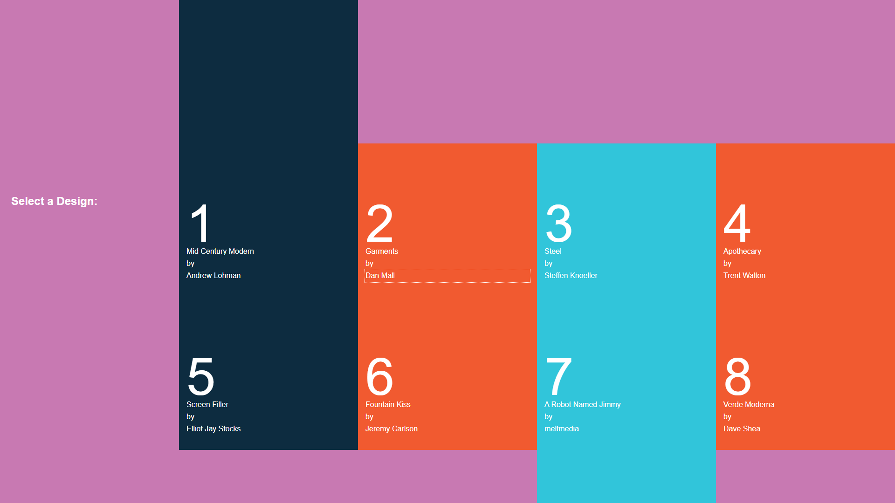
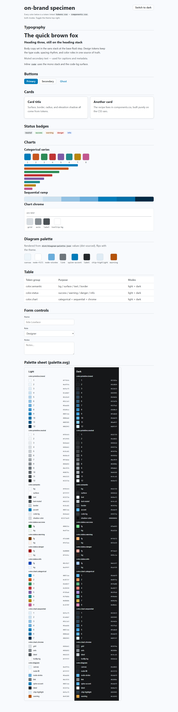
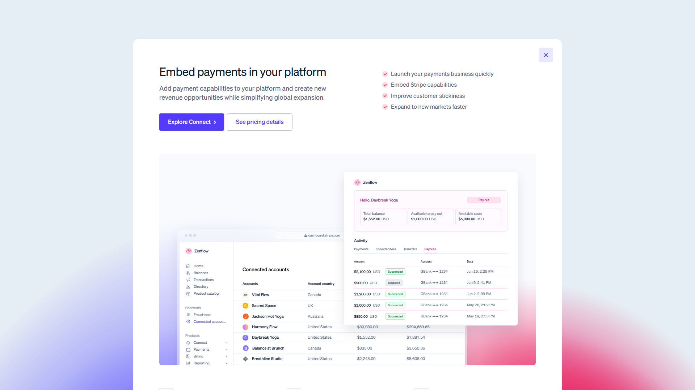
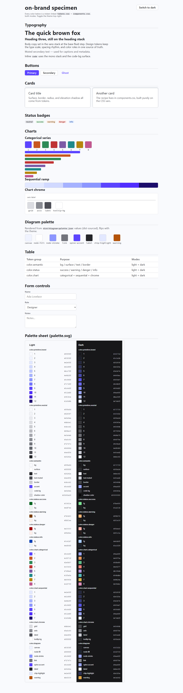
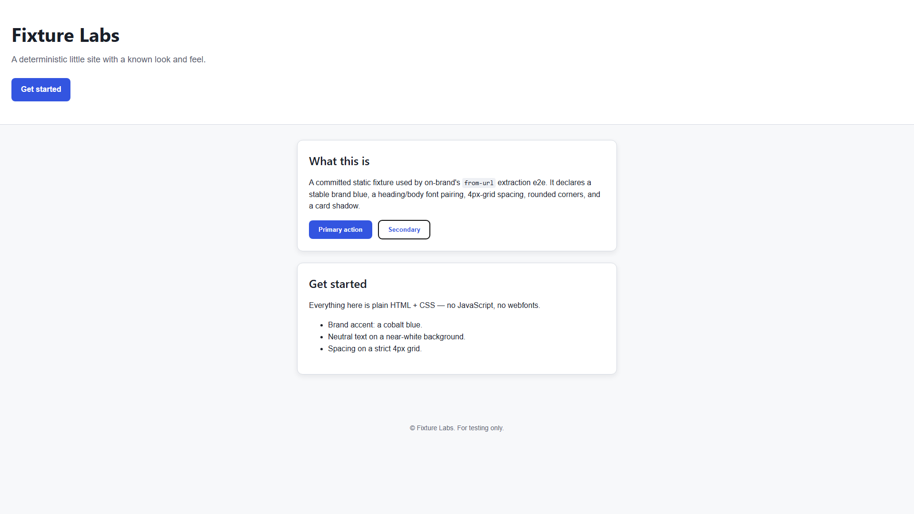
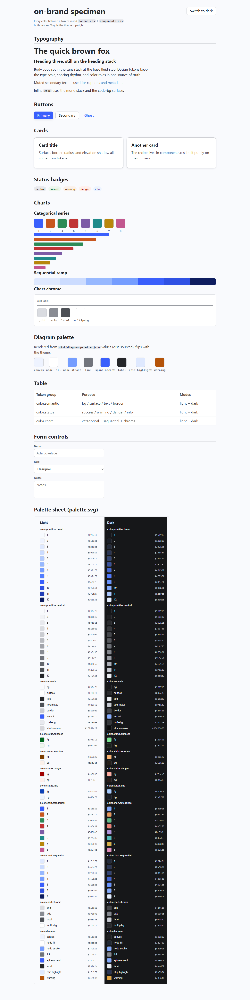

# Step 13 findings: extraction eval against real sites

**Date:** 2026-07-17 (build Step 13). Environment: worktree
`build-step-onbrand-step13` @ branch build-step-onbrand-step13, Windows 11, Node
v24.14.0, dembrandt v0.23.1, Playwright chromium, `claude` CLI v2.1.170
(subscription OAuth). Every number below was produced by running the REAL
`onbrand from-url` pipeline (dembrandt + Chromium + the live LLM passes) against
live URLs; nothing here is estimated. Coverage was scored by the SAME production
functions the Step 8 spike used (`coverageOf` / `meetsMinimumCoverage` /
`substantiveObservationCount` / `isNearEmpty` in `src/extract/engine/adapter.ts`),
run over each proposal's `raw-extraction.json` -- no hand-scored cells
(measurement-validity: score the production artifact via the production path). The
four `raw-extraction.json` files this run produced are committed under
`docs/findings/eval-raw-extractions/` (one per row), so every coverage mark below
is mechanically reproducible from committed evidence, not self-reported prose.

## Site selection (and two documented substitutions)

| # | Kind | URL used | Note |
| --- | --- | --- | --- |
| a | CSS Zen Garden design | `https://csszengarden.com/221/` | live external site |
| b | awwwards-class modern site | `https://stripe.com` | live external site; reachable this run (200) |
| c | workspace-owned | `http://127.0.0.1:8791/` | DOCUMENTED STAND-IN, see below |
| d | garbage anchor | `http://127.0.0.1:8791/blank` | DOCUMENTED STAND-IN, see below |

- **(c) local fixture substitution.** The committed static fixture site
  (`test/fixtures/site/`) was served over HTTP on a local ephemeral port and used
  as the controlled stand-in. Its content is included in this repository, so the
  evaluation does not require access to a maintainer's other projects.
- **(d) garbage anchor realization.** dembrandt rewrites schemeless input to
  `https://` and hard-fails on `about:blank` (Step 8 finding). So, exactly as Step
  8 did, the garbage anchor was realized as a served empty-body HTML page
  (`/blank`: `<html><head><title>blank</title></head><body></body></html>`) --
  functionally about:blank but with a navigable http URL the engine accepts.

## Summary (the 4 acceptance rows)

| Site | URL | Wall time | Min-coverage set met? | Near-empty? | LLM | Vision pre-screen | Gap issue |
| --- | --- | --- | --- | --- | --- | --- | --- |
| CSS Zen Garden 221 | `https://csszengarden.com/221/` | 79s | YES | no | used (ok) | same-family YES (qualified) | none (see Notes; enh #21) |
| Stripe | `https://stripe.com` | 97s | YES | no | used (ok) | same-family YES | none |
| Workspace fixture (stand-in) | `http://127.0.0.1:8791/` | 65s | YES | no | used (ok) | same-family YES | none |
| Garbage anchor | `http://127.0.0.1:8791/blank` | 187s | no (by design) | YES | used (degraded) | n/a (near-empty) | none |

**Acceptance: PASS.** All 3 real sites meet the minimum coverage set (colors with
frequency + role evidence, font stacks, type sizes, screenshots populated); the
garbage anchor is near-empty (3 substantive observations, threshold <= 4); no
crash, no stage failure (every run exited 0); all 3 real-site vision pre-screens
are in-family. Zero blocking gap-issues. One non-blocking enhancement was surfaced
and filed (#21, font-lookalike table gap -- see Notes). The garbage anchor's long
wall time (187s) is expected, not a defect: blank pages take ~90s in dembrandt's
content-wait heuristics (Step 8 measured 90.8s for the same blank page) plus the
three LLM passes.

## Per-field coverage (production `coverageOf`, over each `raw-extraction.json`)

Cells are Y (field populated) / n (empty). The minimum coverage set is
{colors, colorRoleEvidence, fonts, typeSizes, screenshots}; radii/shadows/spacing
are richness, not part of the minimum bar. Every Y/n mark and count in this section
is reproducible: run `coverageOf()` (plus `meetsMinimumCoverage` /
`substantiveObservationCount` / `isNearEmpty`) over the committed
`docs/findings/eval-raw-extractions/<site>.raw-extraction.json` files -- the exact
`raw-extraction.json` each row's proposal emitted this run. Re-scored from those
committed copies, the numbers below reproduce byte-for-byte.

| Site | colors | roleEvid | fonts | typeSizes | spacing | radii | shadows | screenshots | Min set | Substantive obs |
| --- | --- | --- | --- | --- | --- | --- | --- | --- | --- | --- |
| CSS Zen Garden 221 | Y | Y | Y | Y | Y | n | n | Y | MET | 32 |
| Stripe | Y | Y | Y | Y | Y | Y | Y | Y | MET | 198 |
| Workspace fixture | Y | Y | Y | Y | Y | Y | Y | Y | MET | 32 |
| Garbage anchor | Y | Y | n | n | Y | n | n | Y | not met | 3 |

Raw counts (colors / fonts / typeSizes / spacing / radii / shadows / screenshots):
- CSS Zen Garden 221: 8 / 3 / 4 / 17 / 0 / 0 / 1
- Stripe: 125 / 4 / 16 / 20 / 18 / 15 / 1
- Workspace fixture: 11 / 4 / 6 / 7 / 3 / 1 / 1
- Garbage anchor: 2 / 0 / 0 / 1 / 0 / 0 / 1

The two `n` cells on CSS Zen Garden 221 (radii, shadows) are honest-source gaps,
NOT engine gaps -- that design declares no border-radius or box-shadow (Step 8
found the identical pattern on the same page; Stripe, which has them, extracts
both). radii/shadows are outside the minimum coverage set, so the row still MET.
The garbage anchor's residual signal is UA defaults (2 near-neutral colors, one
8px spacing, the viewport screenshot) -- exactly the near-empty shape the anchor
is meant to produce.

## Vision pre-screen (specimen vs source-site screenshot)

Method: the source-site viewport PNG is dembrandt's `--screenshot` capture (in the
proposal's `brand/assets/`); the specimen PNG is a Playwright full-page screenshot
of `onbrand preview`'s `dist/specimen.html` (light mode, 1280px viewport). Both
were viewed directly (the developer agent is vision-capable). This is a pre-screen
before the human M1 eyeball (issue #17), not a pass/fail gate.

### CSS Zen Garden 221 -- same-family: YES (qualified)




Chosen brand: `#0d2c40` (deep navy, LLM pick, HIGH confidence). The navy is the
design's structural anchor -- roles text:177 + accent:178 + border:16, the single
most-used color -- and the specimen's navy seed plus its cool-blue mid-ramp and
neutral greys are drawn straight from the source's palette. Type family matches
(both a clean grotesque sans with oversized numerals in the source). QUALIFIED
because the source is genuinely four-hue (mauve-pink field, deep navy, bright
orange, turquoise) and a single-seed brand necessarily narrows to one; the report
handles this honestly -- its top-5 candidate table surfaces the orange/turquoise/
mauve alternatives, the aesthetic summary names all four hues, the pick is labeled
advisory, and the ~68% disambiguation ceiling (plan Sec 10) is cited. Not a bad
verdict: an in-palette, well-justified, honestly-reported pick.

### Stripe -- same-family: YES




Chosen brand: `#533afd` (blurple, LLM pick). This is Stripe's signature blurple --
the LLM rationale explicitly matches it to the known brand `#635BFF`, and it is the
color of the source's primary CTA ("Explore Connect"), checkmarks, and links. The
specimen's surfaces read as plain neutral near-white/light-gray (NOT distinctly
lavender-tinted); the same-family verdict rests on the exact blurple brand match,
not the surfaces. The sans type family matches. Strong same-family match on the
brand color.

### Workspace fixture (stand-in) -- same-family: YES




Chosen brand: `#3355e0` (cobalt, LLM pick). Matches the fixture's "Get started" /
"Primary action" cobalt buttons; the rationale correctly identifies them and notes
the other candidates are near-black text or neutral greys. Near-white surfaces,
dark neutral text, and rounded cards all carry across; sans type family matches.
Strong same-family match. (Reminder: this is the documented workspace-owned
stand-in, not an external site.)

### Garbage anchor -- n/a


No specimen comparison is meaningful: the extraction is near-empty, so no brand
color was found. The pipeline correctly fell back to the preset seed `#3b63a8`
(LOW confidence, labeled "preset fallback -- no brand-colored candidate in the
extraction (only greys/near-neutrals)", "Treat the pick as a placeholder"). The
LLM color-pick pass also correctly rejected the model's out-of-candidate-set reply
twice (the structural injection firewall) and fell back to the heuristic -- the
intended degraded behavior, not a crash.

## Gaps and filed issues

Per the Step 13 procedure, a "gap" is a site that misses the minimum coverage set,
a crash, a bad vision verdict, or a stage failure. NONE occurred: all 3 real sites
met coverage, the garbage anchor is near-empty, every run exited 0, and all 3
vision pre-screens are in-family. So there are **zero blocking gap-issues**.

One non-blocking ENHANCEMENT was surfaced by the run and filed so it is not lost:

- **#21** -- `from-url`: the `ff-meta-web-pro` (FontFont Meta) stack observed on
  CSS Zen Garden 221 has no entry in the curated font-lookalike table, so the
  proposal kept the observed family with system fallbacks and warned. This is
  graceful-by-design (Decision 7), not an acceptance gap; #21 tracks adding a free
  OFL lookalike entry. Referenced in the CSS Zen Garden row above.

Documented observation (working-as-intended, NOT filed): OKLCH ramp steps were
gamut-clamped on the high-chroma seeds (Stripe blurple, the cobalt fixture) --
this is the documented `ramps.ts` clamp-and-warn behavior (plan Sec 10 /
Decision 10), fired loudly in the notes, and produced in-gamut ramps. No action.

## Reproduction

```powershell
# 1. serve the workspace-owned stand-in + the garbage anchor locally
node <scratch>/eval-server.mjs test/fixtures/site 8791   # prints LISTENING 8791

# 2. run the REAL pipeline against each (LLM passes included)
node bin/onbrand.mjs from-url https://csszengarden.com/221/ --out <dir>
node bin/onbrand.mjs from-url https://stripe.com --out <dir>
node bin/onbrand.mjs from-url http://127.0.0.1:8791/ --out <dir>
node bin/onbrand.mjs from-url http://127.0.0.1:8791/blank --out <dir>

# 3. build a specimen for the vision pre-screen
node bin/onbrand.mjs preview <proposal-dir>   # writes brand/dist/specimen.html
```

Coverage was re-scored offline from each proposal's `raw-extraction.json` via the
production `coverageOf` / `meetsMinimumCoverage` / `substantiveObservationCount` /
`isNearEmpty` exports (`src/extract/engine/adapter.ts`). Those four
`raw-extraction.json` files are committed under
`docs/findings/eval-raw-extractions/` (`csszengarden` / `stripe` /
`workspace-fixture` / `garbage-anchor`), so anyone can reproduce every coverage
mark by importing `coverageOf` and running it over the committed JSON -- no live
network or re-extraction required.
