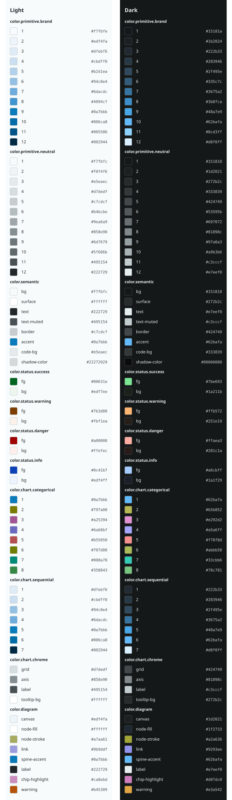

# Water Lilies Brand Guide (DRAFT)

GENERATED as a DRAFT by `onbrand from-image`. Review the inspiration trace, artwork metadata, and generated tokens before adopting this proposal.

## Palette

<!-- onbrand:begin palette -->
<!-- AUTO-GENERATED by `onbrand build` - do not edit between the palette markers. -->

| Token | Light | Dark |
| --- | --- | --- |
| `color.semantic.bg` | `#f7fbfc` | `#151818` |
| `color.semantic.surface` | `#ffffff` | `#272b2c` |
| `color.semantic.text` | `#222729` | `#e7eef0` |
| `color.semantic.text-muted` | `#495154` | `#c3cccf` |
| `color.semantic.border` | `#c7cdcf` | `#424749` |
| `color.semantic.accent` | `#0a7bbb` | `#62bafa` |
| `color.semantic.code-bg` | `#e5eaec` | `#333839` |
| `color.semantic.shadow-color` | `#22272929` | `#00000080` |
| `color.status.success.fg` | `#00631e` | `#7be693` |
| `color.status.success.bg` | `#edf7ee` | `#1a211b` |
| `color.status.warning.fg` | `#7b3d00` | `#ffb572` |
| `color.status.warning.bg` | `#fbf1ea` | `#251e19` |
| `color.status.danger.fg` | `#a00000` | `#ffaea3` |
| `color.status.danger.bg` | `#ffefec` | `#281c1a` |
| `color.status.info.fg` | `#0c41b7` | `#a6cbff` |
| `color.status.info.bg` | `#edf4ff` | `#1a1f29` |
<!-- onbrand:end palette -->
