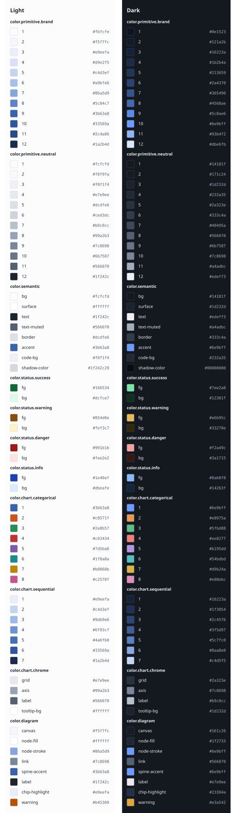

# stale — Brand Guide

<!-- Scaffolded by `onbrand init`. Sections marked TODO are yours to write.
     Content between `onbrand:begin`/`onbrand:end` markers is auto-generated by
     `onbrand build` — never edit inside those fences; prose outside them is
     never touched by the tool. -->

## Identity

<!-- TODO: one line — what this project is and the feeling its surfaces should
     give. Example: "Practical local tooling with a calm, engineered voice." -->

## Logo & assets

<!-- TODO: note the canonical logo/favicon files under brand/assets/ (e.g.
     logo.svg, favicon.svg), clear-space and minimum-size rules, and any usage
     restrictions. Delete this section if the project has no logo. -->

## Palette

<!-- onbrand:begin palette -->
<!-- AUTO-GENERATED by `onbrand build` - do not edit between the palette markers. -->

| Token | Light | Dark |
| --- | --- | --- |
| `color.semantic.bg` | `#fcfcfd` | `#14181f` |
| `color.semantic.surface` | `#ffffff` | `#1d232d` |
| `color.semantic.text` | `#1f242c` | `#edeff3` |
| `color.semantic.text-muted` | `#566070` | `#a4adbc` |
| `color.semantic.border` | `#dcdfe6` | `#333c4a` |
| `color.semantic.accent` | `#3b63a8` | `#6e9bff` |
| `color.semantic.code-bg` | `#f0f1f4` | `#232a35` |
| `color.semantic.shadow-color` | `#1f242c29` | `#00000080` |
| `color.status.success.fg` | `#166534` | `#7ee2a8` |
| `color.status.success.bg` | `#dcfce7` | `#12301f` |
| `color.status.warning.fg` | `#854d0e` | `#e6b95c` |
| `color.status.warning.bg` | `#fef3c7` | `#33270e` |
| `color.status.danger.fg` | `#991b1b` | `#f2a49c` |
| `color.status.danger.bg` | `#fee2e2` | `#3a1715` |
| `color.status.info.fg` | `#1e40af` | `#8ab8f8` |
| `color.status.info.bg` | `#dbeafe` | `#14263f` |
<!-- onbrand:end palette -->

## Typography

<!-- TODO: name the sans / heading / mono stacks (they live in tokens.json
     under `font`) and when to use each. Note webfont sources if any (Google
     Fonts only by default). -->

## Spacing & radius

<!-- TODO: one paragraph — how the 4px spacing grid (`space.1`–`space.10`) and
     the radius scale (sm/md/lg/pill) are applied: card padding, section gaps,
     control corner rounding. -->

## Voice & tone

<!-- TODO: 3–6 bullets describing how this project writes. Examples:
     - concise, no emojis
     - active voice, present tense
     - plain-spoken about errors — say what failed and what to do next
     Then add 3 example rewrites (before -> after pairs). -->

## Do's and don'ts

<!-- TODO: short list of always/never rules for this project's surfaces.
     Example do: "use status tokens for every pass/fail badge".
     Example don't: "no raw hex in components — tokens only". -->
